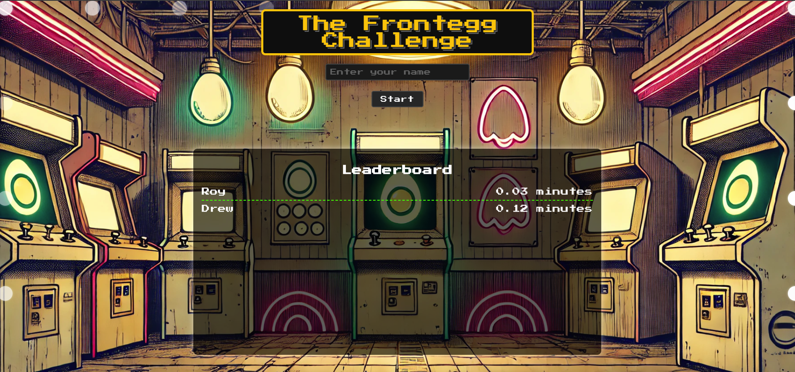

# Leaderboard Application

## Overview

This project is a retro-styled leaderboard applicatios. users start and stop a timer, with the recorded time being displayed on a dynamic leaderboard.



## Features

- **Leaderboard**: Displays users' times, sorted by the fastest time.
- **Timer**: Users can start and stop a timer, and their time will be added to the leaderboard.
- **Retro Design**: The application has a vintage arcade look and feel, including a dynamic, flashing lights border.
- **Persistent Data**: The leaderboard data is saved to a file on the backend, ensuring that it persists across server restarts.
- **Responsive Layout**: The application is designed to be responsive and works on various screen sizes.

## Getting Started

### Prerequisites

Make sure you have the following installed on your machine:

- [Node.js](https://nodejs.org/) (v14 or higher)
- [npm](https://www.npmjs.com/) (v6 or higher)

### Installation

1. **Clone the repository:**

   ```bash
   git clone https://github.com/yourusername/leaderboard-app.git
   cd leaderboard-app
   ```

2. **Install dependencies for both the frontend and backend:**
### Install frontend dependencies
```bash
cd frontend
npm install
```

### Install backend dependencies
```bash
cd ../backend
npm install
```

3. **Running the Application**
- Start the backend server:
```bash
Copy code
cd backend
node index.js
```
The backend will start on http://localhost:4000.
- Start the frontend application:
```bash
cd frontend
npm start
```
The frontend will start on http://localhost:3001.

- Access the application:
Open your browser and go to http://localhost:3001.

```plaintext
leaderboard-app/
│
├── backend/               # Backend server files
│   ├── index.js           # Main server file
│   └── leaderboard.json   # File where leaderboard data is stored
│
├── frontend/              # Frontend React application
│   ├── public/            # Public assets and index.html
│   ├── src/               # React components and styles
│   │   ├── components/    # React components
│   │   ├── App.js         # Main React component
│   │   └── App.css        # Application styling
│   └── package.json       # Frontend dependencies and scripts
│
└── README.md              # Project documentation
```
